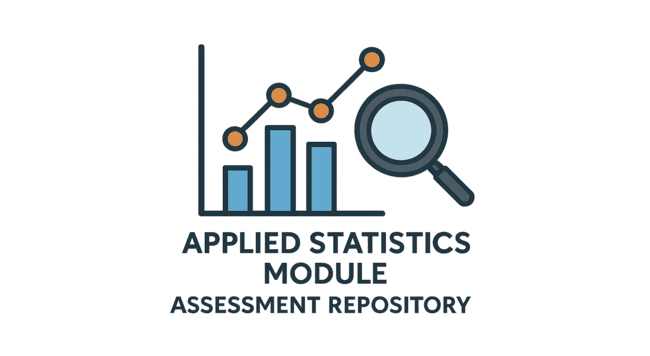

# Applied Statistics Module: Assessment Repository




## Table of Contents

1. [About This Repository](#about-this-repository)
2. [Repository Contents](#repository-contents)
3. [Problems Overview](#problems-overview)
4. [Setting Up Your Environment](#setting-up-your-environment)
5. [Using the Repository](#using-the-repository)
6. [Need Help?](#need-help)
7. [Author](#author)

---

## About This Repository

This repository contains the Applied Statistics assessment, exploring simulation, hypothesis testing, and analysis of variance. It highlights probability estimation, variability in samples, error rates in t-tests, and the advantages of ANOVA for comparisons across multiple groups.

[🔝 Back to Top](#table-of-contents)

---

## Repository Contents

This repository includes the following:

- `img/`: Directory containing image files used in the repository.
- `.gitignore`: A file is used to specify which files and directories should be excluded from version control.
- `README.md`: A file provides an overview of the project, its purpose, and instructions for setup and usage.
- `requirements.txt`: Dependencies needed to run the Jupyter Notebook.
- `problems.ipynb`: A Jupyter Notebook serving as both a report on key realizations and a tool for data analysis.

[🔝 Back to Top](#table-of-contents)

---

## Problems Overview

Problem 1: Extending the Lady Tasting Tea

Let's extend the Lady Tasting Tea experiment as follows. The original experiment has 8 cups: 4 tea-first and 4 milk-first. Suppose we prepare 12 cups: 8 tea-first and 4 milk-first. A participant claims they can tell which was poured first.

Simulate this experiment using numpy by randomly shuffling the cups many times and calculating the probability of the participant correctly identifying all cups by chance. Compare your result with the original 8-cup experiment.

In your notebook, explain your simulation process clearly, report and interpret the estimated probability, and discuss whether, based on this probability, you would consider extending or relaxing the p-value threshold compared to the original design.

Problem 2: Normal Distribution

Generate 100,000 samples of size 10 from the standard normal distribution. For each sample, compute the standard deviation with ddof=1 (sample SD) and with ddof=0 (population SD). Plot histograms of both sets of values on the same axes with transparency. Describe the differences you see. Explain how you expect these differences to change if the sample size is increased.

Problem 3: t-Tests

A type II error occurs when a test fails to reject the null hypothesis even though it is false. For each mean difference d = 0 , 0.1 , 0.2 , … , 1.0 , repeat the following simulation 1,000 times:

    Draw two samples of size 100, one from the standard normal distribution and one from the normal distribution with mean d and standard deviation 1.
    Run an independent samples t-test on the two samples, rejecting the null hypothesis if the p-value is less than 0.05.
    Record the proportion of times the null hypothesis is not rejected.

Plot this proportion against d , and explain how the type II error rate changes as the difference in means increases.

Problem 4: ANOVA

Generate three independent samples, each of size 30, from normal distributions with means 0, 0.5, and 1, each with standard deviation 1.

    Perform a one-way ANOVA to test whether all three means are equal.
    Perform three independent two-sample t-tests: samples 1 vs 2, 1 vs 3, and 2 vs 3.
    Compare the conclusions.

Write a short note on why ANOVA is preferred over running several t-tests.

[🔝 Back to Top](#table-of-contents)

---

## Setting Up Your Environment

### Prerequisites

- Python 3.13.5
- Anaconda
- Bash shell
- Git

### Dependencies

Dependencies are essential for ensuring the proper functioning of this repository. In this project, the dependencies have been kept minimal to streamline the setup process and avoid unnecessary complexity.

### Installation Steps

1. Install Anaconda: 
    - Download the Anaconda distribution for your operating system from the official Anaconda website: https://www.anaconda.com/products/individual
    - Follow the installation instructions provided on the website. 
      During installation, MAKE SURE you check the two checkboxes
       * Add to PATH variable
       * Make this version your default Python


2. Create a new virtual environment (recommended):  
   ```bash
   conda create -n stats-env python=3.9
   conda activate stats-env
   ```
   If you don’t use Anaconda, you can create a venv instead

   ```bash
   python -m venv venv
   ```
   To activate the environment:

   * On Linux/Mac

     ```source
     venv/bin/activate
     ```

   * On Windows

     ```bash
     venv\Scripts\activate
     ``` 

3. Install Git:  
   Download from https://git-scm.com/downloads and follow instructions.  

4. Configure Git:  
   ```
   git config --global user.name "Your Name"
   git config --global user.email "your.email@example.com"
   ```
5. Install Visual Studio Code (VS Code):

   Download from https://code.visualstudio.com/download  and follow 
instructions.

6. Clone the Repository:
   ```
   git clone https://github.com/TomUszyn/applied-statistics.git
   ```

7. Install Dependencies:
   ```
   pip install -r requirements.txt
   ```

[🔝 Back to Top](#table-of-contents)

---

## Using the Repository

To work with the notebooks in this project, follow these simple steps:

### **Install Jupyter (if not already installed):**
   ```bash
   pip install notebook
   ```

### Opening the notebook from terminal

   * From terminal:
   ```bash
   jupyter notebook problems.ipynb
   ```
### Using the Notebook in VS Code

1. **Open the project folder:**
   - Go to **File > Open Folder** and select the cloned project directory.
   - Click on `problems.ipynb` (or the notebook you want to run).
   - VS Code will automatically detect it as a Jupyter notebook.

2. **Select the correct Python environment:**
   - In the top‑right corner of the notebook, click the **kernel selector**.
   - Choose the Anaconda or virtual environment you created earlier.

3. **Restart the kernel (recommended before running cells):**
   - Press **Ctrl + Shift + P** in VS Code.
   - Type:
     ```bash
     Jupyter: Restart Kernel and Run All
     ```
   - Press **Enter** to confirm.
   - This restarts the kernel and executes all cells from the beginning, ensuring a clean state.

4. **Run cells (if you prefer step‑by‑step execution):**
   - Click on the first cell.
   - Press **Shift + Enter** (keyboard shortcut) **or** click the ▶ **Run button** (play icon).
   - Continue running cells one by one, or select **Cell > Run All** to execute everything.

[🔝 Back to Top](#table-of-contents)


---

## Need Help?

If you have any questions, feel free to reach out. 

- **Email:** [tomaszuszynski3@gmail.com](mailto:tomaszuszynski3@gmail.com)

[🔝 Back to Top](#table-of-contents)

---

## Author

**Tomasz Uszynski**

I am a student at Atlantic Technological University pursuing a Higher Diploma in Science in Computing (Data Analytics). My objective is to build robust, data-driven solutions where technical proficiency in Python and automation meet analytical problem-solving. I focus on the end-to-end data analysis lifecycle, combining technical automation with modern computational tools to extract meaningful insights from diverse datasets.

### Technical & Analytical Toolkit

* **Data Analysis & Manipulation:** Proficient in the **Python** ecosystem, leveraging **Pandas** and **NumPy** for data cleaning, transformation, and structural analysis.
* **Statistical & Computational Methods:** Experienced in applying hypothesis testing, simulations, and probabilistic modelling to validate data-driven conclusions.
* **Machine Learning:** Skilled in developing predictive models using **scikit-learn**, **TensorFlow**, and **Keras**, covering both supervised and unsupervised learning workflows.
* **Visualisation:** Strong command of **Matplotlib** and **Seaborn** for exploratory data analysis and communicating findings through clear, professional visualisations.
* **Systems & Automation:** Knowledgeable in **Linux (Ubuntu)** and **Windows**. Experienced in **Bash** and **YAML** for automating data pipelines and ensuring environment consistency.
* **Database Management:** Competent in using **MySQL** for data storage, retrieval, and structured querying.

[🔝 Back to Top](#table-of-contents)

---