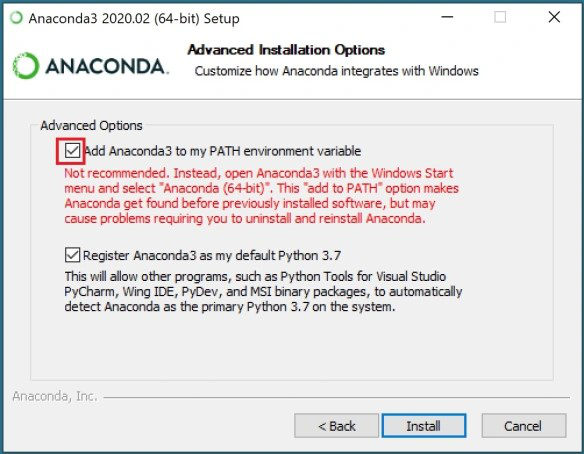

# Applied Statistics Module: Assessment Repository


## Table of Contents

1. [About This Repository](#about-this-repository)
2. [Repository Contents](#repository-contents)
3. [Problems Overview](#problems-overview)
4. [Setting Up Your Environment](#setting-up-your-environment)
5. [Using the Repository](#using-the-repository)
6. [Need Help?](#need-help)
7. [Author](#author)

---

## About This Repository

This repository contains the Applied Statistics assessment, exploring simulation, hypothesis testing, and analysis of variance. It highlights probability estimation, variability in samples, error rates in t-tests, and the advantages of ANOVA for comparisons across multiple groups.

---

## Repository Contents

This repository includes the following:

- `img/`: Directory containing image files used in the repository.
- `.gitignore`: A file is used to specify which files and directories should be excluded from version control.
- `README.md`: A file provides an overview of the project, its purpose, and instructions for setup and usage.
- `requirements.txt`: Dependencies needed to run the Jupyter Notebook.
- `problems.ipynb`: A Jupyter Notebook serving as both a report on key realizations and a tool for data analysis.

---

## Problems Overview

Problem 1: Extending the Lady Tasting Tea

Let's extend the Lady Tasting Tea experiment as follows. The original experiment has 8 cups: 4 tea-first and 4 milk-first. Suppose we prepare 12 cups: 8 tea-first and 4 milk-first. A participant claims they can tell which was poured first.

Simulate this experiment using numpy by randomly shuffling the cups many times and calculating the probability of the participant correctly identifying all cups by chance. Compare your result with the original 8-cup experiment.

In your notebook, explain your simulation process clearly, report and interpret the estimated probability, and discuss whether, based on this probability, you would consider extending or relaxing the p-value threshold compared to the original design.

Problem 2: Normal Distribution

Generate 100,000 samples of size 10 from the standard normal distribution. For each sample, compute the standard deviation with ddof=1 (sample SD) and with ddof=0 (population SD). Plot histograms of both sets of values on the same axes with transparency. Describe the differences you see. Explain how you expect these differences to change if the sample size is increased.

Problem 3: t-Tests

A type II error occurs when a test fails to reject the null hypothesis even though it is false. For each mean difference d = 0 , 0.1 , 0.2 , … , 1.0 , repeat the following simulation 1,000 times:

    Draw two samples of size 100, one from the standard normal distribution and one from the normal distribution with mean d and standard deviation 1.
    Run an independent samples t-test on the two samples, rejecting the null hypothesis if the p-value is less than 0.05.
    Record the proportion of times the null hypothesis is not rejected.

Plot this proportion against d , and explain how the type II error rate changes as the difference in means increases.

Problem 4: ANOVA

Generate three independent samples, each of size 30, from normal distributions with means 0, 0.5, and 1, each with standard deviation 1.

    Perform a one-way ANOVA to test whether all three means are equal.
    Perform three independent two-sample t-tests: samples 1 vs 2, 1 vs 3, and 2 vs 3.
    Compare the conclusions.

Write a short note on why ANOVA is preferred over running several t-tests.

---

## Setting Up Your Environment

### Prerequisites

- Python 3.8+
- Anaconda
- Bash shell
- Git

### Dependencies

Dependencies are essential for ensuring the proper functioning of this repository. In this project, the dependencies have been kept minimal to streamline the setup process and avoid unnecessary complexity.

### Installation Steps

1. Install Anaconda: 
    - Download the Anaconda distribution for your operating system from the official Anaconda website: https://www.anaconda.com/products/individual
    - Follow the installation instructions provided on the website. 
      During installation, MAKE SURE you check the two checkboxes
       * Add to PATH variable
       * Make this version your default Python



2. Install Git:
    - Download Git for your operating system from the official Git website: https://git-scm.com/downloads
    - Follow the installation instructions provided on the website.

3. Configure Git:
    - Open a terminal or Git Bash.
    - Set your name and email address using the following commands:
      ```
      git config --global user.name "Your Name"
      git config --global user.email "your.email@example.com"
      ```

4. Install Visual Studio Code (VS Code):
    - Download Visual Studio Code for your operating system from the official VS Code website: https://code.visualstudio.com/download
    - Follow the installation instructions provided on the website.

5. Clone the Repository:
   ```bash
   git clone https://github.com/TomUszyn/applied-statistics.git
   ```

5. Install Dependencies:
   ```bash
   pip install -r requirements.txt
   ```

---

## Using the Repository


### Exploring the Jupyter Notebook

Make sure you have a Python environment with Jupyter installed. If not, you can install it by running:
```bash
pip install notebook
```

To open the notebook:
```bash
jupyter notebook problems.ipynb
```
VS Code open:

* Go to File > Open Folder, and select the cloned project directory where the weather.ipynb file is located.

* Select the Anaconda Environment in VS Code:

    - In the top-right corner of the notebook interface, click on the kernel selector. This will open a list of available Python environments.

    - Choose the Anaconda environment that has Jupyter installed. If you created a custom environment using conda, it will appear in this list.

   Once you select the correct environment, the kernel should switch to that environment, and you'll be ready to run the notebook.

* Click on weather.ipynb to open it. VS Code will automatically detect that it's a Jupyter notebook and will open it in the notebook interface.

* To execute the notebook:

    * Click on the first cell of the notebook.
    * Press Shift + Enter or click the Run button (a play icon) located on the left side of the cell to run it.
    * Continue running the remaining cells in the notebook by clicking the Run button for each cell, or press Shift + Enter to run them sequentially.
    * You can also select Run All from the Cell menu at the top to execute all cells at once.

In VS Code, "Restart Kernel and Run All" (via Ctrl + Shift + P → Jupyter: Restart Kernel and Run All) restarts the kernel and runs all cells from the beginning, ensuring a clean state and that all dependencies are properly reloaded.   

---

## Need Help?

If you have any questions, feel free to reach out. 

- **Email:** [tomaszuszynski3@gmail.com](mailto:tomaszuszynski3@gmail.com)

---

## Author

**Tomasz Uszynski**

I am an Atlantic Technical University in Ireland student pursuing a Higher Diploma in Science in Computing (Data Analytics). My technical expertise includes:

- **Operating Systems:** Proficient in Windows and Linux (especially Ubuntu).
- **Programming:** Skilled in Python for data analysis.
- **Databases:** Familiar with MySQL.
- **Web Technologies:** Basic knowledge of Apache.
- **Scripting:** Experienced in Bash scripting and YAML for automation and configuration.

I’m passionate about analysing datasets to derive insights and develop data-driven solutions.


